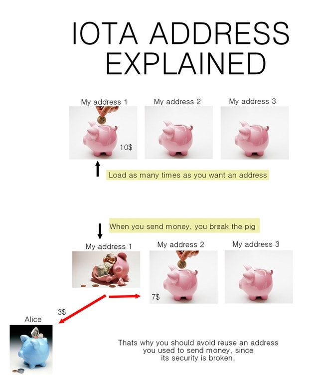

# IOTA 概念
## 协调器Coordinator
IOTA目前正处于实现广泛应用和标准化的过渡阶段，与比特币、以太坊和其他所有分布式协商一致协议一样，IOTA网络需要一个辅助工具来在早期提供防范34%大规模算力攻击的保护。
由于IOTA独特的底层架构，这种辅助工具就是Coordinator。它从本质上来说，是帮助网络在成长过程中免受威胁的工具，类似于婴儿自行车的辅助轮。直到网络中活跃节点的数量足以使其在没有协助的情况下正常发展时，Coordinator就会永久关闭。
这并不意味着IOTA网络是中心化的，它依旧是100%去中心化的，每个节点的验证规则并没有被Coordinator所改变，Coordinator不可能凭空创造出IOTAs或批准双花。

## 闪电通道flash channel
Flash Channels 是一个支持即时的高吞吐量交易的双向离线（off-Tangle）支付通道。 从本质上说，它们为各方提供了一个高频率的交易方式，而且无需等待每个交易在公共的  IOTA 网络上得到确认。
闪电通道是延展IOTA核心能力使其能够处理实时交易流的第一个模块。该功能与IOTA网络的快速和免费的解决方案完美契合，在物联网和其他的互联网领域中是一项新的、颠覆性的应用。
更多介绍， 请参考http://www.iotachina.com/shunshimianfeishandiantongdao.html 

## 掩码认证消息 (Masked Authenticated Messaging)
掩码认证消息（MAM）是IOTA最强大的IXI模块之一，打开了基于IOTA应用的新领域。确保数据完整性和访问管理控制是一些应用的必备条件，如在线更新（OTA）、数据市场、雾分析、端到端可核查的供应链、自动保险等等。像Youtube和其他媒体一样，MAM也有频道。频道所有者可以发布新数据，观看者可订阅频道来获取可用的数据。这种所有权由IOTA通过Seed来实施和保护的。当在频道上发布新消息时，发布者可以有三种选项。Public（公共模式）：每个人都可以查看。Private（私有模式）：只有你（即种子所有者）可以查看。Restricted（受限模式）：你可以将一个密钥告诉某个人，授权他成为查看者。这个密钥在源代码中被命名为sideKey。所以在这篇文章中，我也会沿用sideKey的称呼。而且，在任何模式下，root可以作为消息标识符被赋予给观看者以便从缠结中找到消息。MAM将每条消息发送到不同的地址，但有详细的有用信息来连接它们。在这条消息链上，一代传到下一代，旧消息总是引导新的，它的流动是单向的。掩码消息存储在交易的signatureFragment中。因为在Snapshot之后会删除所有交易和零余额的地址，所以Snapshot之前的所有MAM都会被删除。为了防止这种情况的发生，MAM存储在了Permanode中，它不会执行Snapshot。详细介绍请参考http://www.iotachina.com/iotamaskedauthenticatedmessage.html

## 种子 Seed
种子是81位长的字符串，而且你必须使用A、B、C…Z和数字9随机产生一个长度为81位字符的串。
当你访问IOTA钱包时，你只需要输入IOTA种子即可。所以，请务必妥善保管好你的种子。

不安全的种子生成方法
```text
1. 随便在键盘上敲打（这种方法产生的字符串不是像你想象的那么具有随机性）
2. 手动输入产生种子（人们的输入也不总是具有随机性）
3. 使用不安全的在线种子生成器（你的资金有可能会被盗窃）
4. 使用任何的Windows PowerShell 或 Command Prompt （这种方法完全不会产生随机组合，而你的种子也将会非常容易遭受残暴地破坏）
```

安全的种子生成方法
```text
 以下这些是通过本社区安全验证的种子生成器。如果你使用了任何“未经认证的种子生成器：（或相同用途的生成器），那么后果自负。此外，离线种子生成器会比在线种子生成器更加安全可靠。
通过命令行， 离线产生随机种子
你可以根据你的操作系统选择以下的操作命令，离线来产生种子：
Linux
> cat /dev/urandom |tr -dc A-Z9|head -c${1:-81}
Mac
> cat /dev/urandom |LC_ALL=C tr -dc ‘A-Z9’ | fold -w 81 | head -n 1

在线产生随机种子
如果你不清楚在哪里/如何运行这些命令，你可以使用以下网站的种子生成器：
1. https://ipfs.io/ipfs/QmdqTgEdyKVQAVnfT5iV4ULzTbkV4hhkDkMqGBuot8egfA
2. https://github.com/eukaryote31/iota-seed-gen
3. https://github.com/erdii/iota-seedgen

```

## 地址 Address
传统的以区块链为基础的系统，例如比特币，你的钱包地址是可以被多次重复使用的。但与之相反，IOTA的地址(在进行对外转账时)只能被使用一次。也就是说，一个IOTA地址如果只用来收账，可以使用无限次。但一旦当你使用这个地址向外转账完成后，就不应该再使用改地址了。这是因为，当你对外进行转账的时候（如果你发送的是IOTA），这个特定地址中的部分私有密钥被暴露，进而给了其他人（例如黑客）暴力破解全部密钥，进而最终获得存储在这个地址中的所有IOTA 的可能性。你通过同一个IOTA地址向外转账的次数越多，黑客就越容易暴力破解你的密钥。需要注意的是，获得一个地址的密钥不会暴露你的IOTA种子或是在你的种子（账户）中的其他地址的密钥。

总之，对于一个IOTA地址，只要我们不对外进行转账操作（“向外发送”的操作），我们可以使用这个地址进行无限次的安全收账。但一旦你使用这个地址向外转账后，这个地址不应该再被使用了！

您可以参考下图存钱罐的示意图以加深理解。




参考文献：
- http://www.iotachina.com/iotakepuxilie3-iotadizhiruhegongzuo.html
- 
## 地址索引 address index
当一个新地址被生成时，它是由一个种子和地址索引组合而成的，地址索引可以是任何一个正整数（包括“0”）。IOTA钱包通常从地址索引0开始生成地址（通过IOTA种子和地址索引0）。如果钱包发现这个地址没有被附加到缠结（Tangle）中，钱包会用这个地址作为一个新的地址。但是当它发现某个地址如果已经被连接到缠结(Tangle)中，它会跳过这个地址索引，继续生成并直到找到新的未被使用的地址为止。

## 群集节点 Swarm nodes
待完善。

## Tips
最近未获得验证的交易，称为“tips”。

## Bundle
在IOTA中发起的一次转账，就是一个包含了输入和输出的Bundle。 Bundle是原子操作， 也就是说如在bundle里的转账记录要么被Tangle网络接受，要么不会被接受，不会有第三种状态。

## 里程碑milestone
待完善。  

## 全节点（fullnode）和永久节点（permanode）
待完善。 
全节点和永久节点都会保存和同步整个Tangle网络的数据。 不同的地方是全节点会执行快照， 清除所有交易和零余额地址， 附加在交易的信息也会丢失，不适合放一些需要追踪记录的信息（比如MAM）。 而永久节点不会执行快照，所以原始信息都会被保存。 全节点运营有节点激励计划（比如说CarrIOTA Field）。 永久节点应该也有对应的激励计划， 但目前暂时没有查到相关信息。

## 快照
待完善 。
每执行一次快照就会清除所有交易和零余额的地址。 

参考文献：
- http://www.iotachina.com/iotakepuxilie3-iotadizhiruhegongzuo.html
