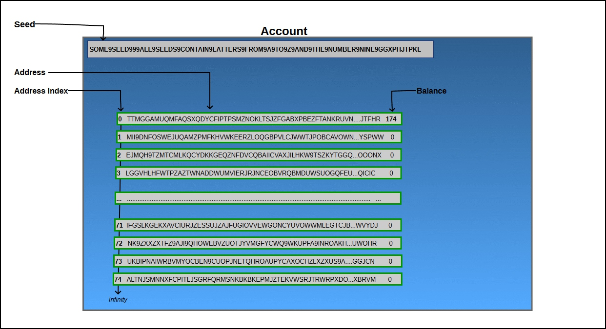

# Q & A 
## 钱包相关
-  IOTA的种子安全么？
> IOTA种子由81个字符组成，你可以使用大写的A-Z和数字9来组成。则IOTA种子的可能性组合有：27^81 = 8.7×10^115。
现在我们假设你有一台超级计算机，它由我们的太阳系中的全部物质组成，并由太阳100%提供动力。使用这台超级计算机，可以使你（从某种程度上）在一秒钟内生成并读取1万亿个不同种子。8.7×10^115 种子组合 / 1×10^12 每秒钟生成 = 8.7×10^103 秒钟 = 2.8×10^96 年

- IOTA的对外转账的地址为什么不能重复使用？
>  待完善。 

- 附加到缠结（Attach to Tangle）是什么意思？
> 转账交易的过程可以分为两个主要步骤：
a. 对转账交易进行本地签名，这一步需要使用您的IOTA种子进行签名操作。
b. 把准备好的转账交易数据，从缠结中选择两个尚未进行的交易，然后做POW， 这一步也被称为“附加”。
下面的比喻让人更容易理解：
第一步，就像写一封信。 你拿一张纸，在上面写一些信息，在底部签名，证明确实是你写的，放在一个信封里，然后写上收件人的地址。
第二步，为了附加上我们的“信”（转账交易），我们去缠结随机挑选两封最新的“信（转账交易）”，并在我们的“信”和参考两封“信”直接建立链接。

- 为什么地址要被附加到缠结（Tangle）？
> 在钱包中生成新地址的时候，我们应该在使用之前始终将其附加到“缠结”。原因是这个钱包并没有在本地保存任何账户相关的数据，而是从缠结中获得所有必要的数据。 因此，如果一个地址还没有附加到缠结，则它可以安全地接收IOTA，但是你不一定能在你的账户中看到这个地址中的余额，因为这个钱包可能还没有把这个地址与你的账户相关联。 现在，如果我们想完全理解这个，那么它就会变得更复杂一些，所以如果你不想深入挖掘，可以跳到下一章节。
有趣的是，如果我们向尚未附加到纠缠的地址发送转账交易，那么这个地址将通过这个交易自动地被附加到缠结。但是，如果他们在接收交易时自动附加，为什么我们还需要附加这个地址到缠结中？正如我们前面介绍的，地址是从索引0开始产生的。现在当钱包在缠结中寻找相关的地址时，它将首先在索引0处寻找地址。如果它发现匹配，继续在索引1处查找地址，然后在索引2，3等处查找地址，直到找不到与当前索引号匹配的地址。我们假设地址0,1,2和3已经被附加到缠结，地址4没有被附加，但地址5中存在一些IOTA余额。当钱包找到地址4时，钱包将停止搜索相关的地址，因此不会看到地址5中的余额。为了避免这种情况，在钱包允许我们产生一个新地址之前，我们需要将已有的地址附加到缠结 。
下面这个动画演示了当我们向一个钱包转账时的工作流程。

我们一开始有174 IOTA余额，然后我们发给Bob 24 IOTA。这笔交易发生的顺序如下：
从我们钱包的第一个地址中扣除所有的174个IOTA，然后把它分为两份（150 + 24）
发送150个IOTA到我们的下一个未被使用的地址
发送另外的24个 IOTA到Bob的地址
这样一来，我们钱包的第一个地址现在就被视为已经使用过了，其余额为0，而我们钱包的余额则存放在了新地址中。同样的事情也发生在我们给Alice转账60个IOTA的过程中。

- 在快照之后发生了什么？
> 现在我们知道了IOTA钱包如何使用地址，我们也可以了解为什么在快照之后我们的余额显示为0。
当一个快照发生时，所有的转账交易将从缠结（Tangle）中删除，只留下每个地址拥有多少IOTA的记录。如果快照是在我们给Alice转账之后发生的，快照将会记录我们的地址“EJMQH…”拥有90个IOTA。然而，当钱包在下一次扫描缠结（Tangle）查找已经被使用过的地址的时候，这个转账交易将会因为快照而消失，所以，钱包不会再知道“EJMQH…”这个地址属于我们。
当快照发生后，我们需要重新生成3个地址（地址索引0,1和2），以便钱包可以从缠结（Tangle）查询并检查每个地址的余额，从而知道这90个IOTA是我们的。 所以，如果我们在快照之前创建的转账交易越多，拥有IOTA余额的地址索引就离地址索引0越远，我们也就需要在快照之后 （重新）生成更多的地址来进行查找。

- 如何尽快确认”pending”的交易？
> “Pending”交易是指，当用户从他们的钱包，交易所或其他人钱包发送IOTA至另外的钱包时，IOTA没有抵达或者没有在余额中显示出来。交易已经发送，并且能够在历史中查看到，但是由于交易并没有在缠结中确认，因此，它不会显示正在你的余额中。出现pending的交易时， 你可以下载最新的钱包， 在钱包配置连接较快的节点， 进入钱包后，查看pending的交易， 点击show bundle， 在Bundle界面中，可以发现Reattach，此功能用于重新连上缠结，可以执行多次。一般我至少会重复链接5次，直至pending被确认， 变为confirmed状态。 

- 查看钱包余额为什么必须先生成地址？
> IOTA不会保存本地钱包文件（比如BTC钱包数据），因此你的密钥基本上就算是你的“密码”。在生成地址之后，系统会循环访问数据库，并且检查你的地址中是否存在余额。这样一来，只要你有密钥和保持相连及同步的钱包，你就能随时随地获取资金。

- 如何保证我的IOTA代币的安全？
> 你的IOTA是和你的密钥绑定的。
首先，确认你的密钥是安全的，无论你的密钥是在图形用户界面的密钥生成器里生成的还是你自己设置的81位字母、拉丁文、大写短语等等，其中包含几个9。
不要选择类似HERE9DO9I9STORE9MY9IOTA9DONT9HACK9ME形式的短语。
好的例子：（一定要传递出这个密钥中没有钱，你不该使用这个密钥的信息）
QXAWCPVROVGJKWGMAVTQCGWXVHHQGJIROSLGVGWKNXXPJAYJNEBPWYANPUOWJWVSCMXSLMJP9RPQLSNIW
由于密钥是很贵重的，你可以印出来进行线下保存，印在纸上，存在几个不同的U盘上，用密码管理器进行加密。
有了密钥，你就能在世界上任意地方获取你的代币，只要有网络和钱包就行。
千万不要弄丢了，密钥=你的钱。
如果你把密钥弄丢了，你就永远不能拿回这笔IOTA代币。所以说要确保这种情况永远不会发生！

- 地址可以重复使用吗？
> GUI的帮助栏告诉我们：
“你在使用某地址进行接收的前提是你没有在外部交易中用过这个地址。这也就意味着，一旦你用一个具体的地址作为输入发送了一笔交易，你就永远都不能再重复使用这个地址。这是因为IOTA采用了Winternitz一次性签名，地址每被重复使用一次，安全度就会大打折扣。”

- 为什么我要重放交易（replay transactions）以及如何重放交易（replay transactions）？
> 因为有些时候你的交易是网络无法访问到的。大多数交易都能得到确认，但并不是所有交易都能如此。大约有三分之二的交易都能得到确认，因此在其它情况下你应该试试重放。
如果交易一直没有得到确认，你就可以重新发起交易。

- 为什么我在使用网络之前要先把地址添加到tangle网络中，如果我不这么做会怎么样？
> 如果你不添加地址，你就无法接收IOTA代币，添加就意味着你允许其他人的确认。
如果你的地址仍然“添加在tangle网络中……”，那么你就可以正常使用它了。

- 我怎么查看自己在网络中的交易？有没有专门的浏览器？
> 的确有一些浏览器。
有部分附加功能的浏览器：iota.cool
非官方IOTA浏览器1：tangler.iotabr.com
非官方IOTA浏览器2：iota.tips

- 什么时候应该重新广播？什么时候应该重放？
> 从www.iota.learn.org/FAQ中找答案：
“重新广播的过程就是再次向你的所有邻节点发送同一笔交易。在大多数情况下，重放交易更容易被网络接受，除非你很确信你的邻节点没有收到你的交易。”
“重放的过程就是你‘重新添加’你的交易到Tangle网络的另一部分，并等待交易被接受。这样一来，你就是在完全重新进行这个交易流程（费用选择和PoW）。”

## 代币相关
- 如何获取IOTA代币？
>  方法一. 交易所购买, IOTA的交易所主要是币安、OKEX、bitfinex ； 方法二.放交易所里生利息, Bitfinex是香港的一家大型数字货币交易场所，其提供融资融币业务。你可以把IOTA放出去收利息，但是利息不是特别高。方法三： 混社区和论坛， 接受打赏   方法四： “挖矿”，用自己的计算机提供算力，获得IOTA打赏。 比如运营一个全节点，加入CarrIOTA Field的节点激励计划  方法五： 参加IOTA的活动， 关注IOTA微博奖励5mIOTA有奖征文、,OKEX推广抽奖活动等等。想要及时了解并参与IOTA的活动，关注IOTACHINA新浪微博便可。  方法六： 加入IOTA中国社区。

- IOTA如果要成为支付的代币，是否可以避免较大币价波动？ 
> 待完善 

## 分布式账本相关
- IOTA如何解决双花问题？
>  假设使用加权随机行走算法选择tip， 那么最终其中一个分支将有更高的权重，因此会围绕有效的那笔交易形成共识。 这里还会引入“ 确认置信度（confirmation confidence）”的概念。 这种置信度衡量了交易被Tangle其余部分的接受程度。交易的置信度是确认它的tip的百分比。一旦一个交易达到了一个非常高的置信度阈值，比如说95％，那么它不太可能会被排除在共识之外了。但是，我们可以认为是不太可能 ，但不是一定不可能，如果想要作弊，并且具有足够的算力的话，还是可以尝试双花的。 尝试双花的方案是尽可能多地创建交易，试图提高某个新交易分支的累积权重。如果某人有足够算力的话，她可以让整个IOTA网络相信她并跟随她的新分支，从而改写历史记录，成功地完成双花。这个有点类似于比特币网络中始终选择最长的那条链的机制。 

- IOTA如何进行账本的同步？
>  待完善。 

- IOTA区块链是否有分叉？
> 待完善 

- IOTA如何做到让数据不可篡改？
> 待完善 

- 每当节点想要发送交易时，它必须随机验证前序的两个交易， 那么节点是根据什么算法选择要可以批准的那两笔交易的呢？
> 为了找到可以批准的交易，避免导致自己的交易被孤立，节点会运行“tips选择算法”。IOTA的缠结并没有特别委托任何算法，但是白皮书以马尔可夫链蒙特卡罗(MCMC)为举例。 

- IOTA如何实现离线交易？
> 待完善 

-  IOTA是否支持智能合约？
> IOTA不会发布“原生IOTA智能合约”，而是将提供一个智能合约层，任何有能力的组织或者个人都可独立的基于IOTA智能合约层来实现IOTA智能合约。

- 请介绍 IOTA的工作量证明
> 待完善 

- 为什么IOTA具有很好的抗量子攻击特性？
> 待完善 

参考文献：
- http://www.iotachina.com/iotakepuxilie3-iotadizhiruhegongzuo.html
- http://www.iotachina.com/luniotadenzhonghuoqufangshi.html
- http://www.iotachina.com/iota-ruhejinkuaiquerenpendingdejiaoyi.html
- 图解介绍缠结一 http://www.iotachina.com/tujiejieshaochanjie.html
- 图解介绍缠结第二部分：交易率，延迟与随机行走 http://www.iotachina.com/tujiejieshaochanjiedierbufenjiaoyishuaiyanchiyusuijixingzou.html
- 图解介绍缠结第3部分：累积权重和加权的随机行走 http://www.iotachina.com/tujiejieshaochanjiedi3bufenleijiquanzhonghejiaquandesuijixingzou.html
- 图解介绍缠结第4部分：批准者, 余额和双花 http://www.iotachina.com/tujiejieshaochanjiedi4bufenpizhunzhe-yueheshuanghua.html
- 图解介绍缠结第5部分：共识、确认置信度与协调器 http://www.iotachina.com/tujiechanjie5.html
