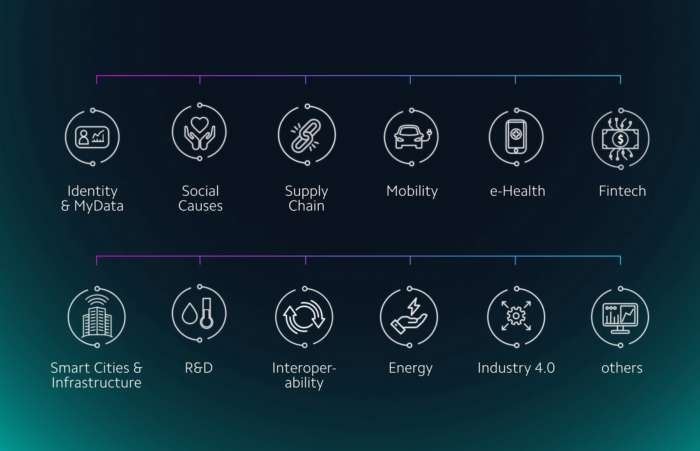

# 历史大事件

2017年Q1  成立基金会
> 基金会的核心自然是开发人员，研究人员，顾问和业务开发人员，他们将建立并推动采用IOTA协议。
该联盟将由跨国集团，创业公司，研究机构和其他非营利组织组成。
所有这些将组成不同领域的具体工作组。

IOTA 创始人参加第五届博世互联世界（Bosch Connected World 2018，简称 BCW18）
IOTA 创始人在展会上表示：到 2018 年年底，IOTA 计划结束“测试”状态，并围绕物联网领域建立了一个强大的网络生态以及一系列外围项目

2018年2月28日， Factory 宣布IOTA 将入驻柏林 Startup-Hub Factory，以便紧跟创业风潮并更加深入的接触区块链产业。

IOTA和DCI的纠葛和邮件泄露始末
http://www.iotachina.com/leakedemailsseeminglyexonerateiota.html
http://www.iotachina.com/guanyumit-dcidianziyoujianxieluqingkuangdeguanfangshengming.html

IOTA对DCI的官方回应
http://www.iotachina.com/iotazhenduimit-dcideguanfanghuiying-diyibufen.html
http://www.iotachina.com/iotazhenduimit-dcideguanfanghuiying-dierbufen.html
http://www.iotachina.com/iotazhenduimit-dcideguanfanghuiying-disanbufen.html
http://www.iotachina.com/iotazhenduimit-dcideguanfanghuiying-disibufen.html
