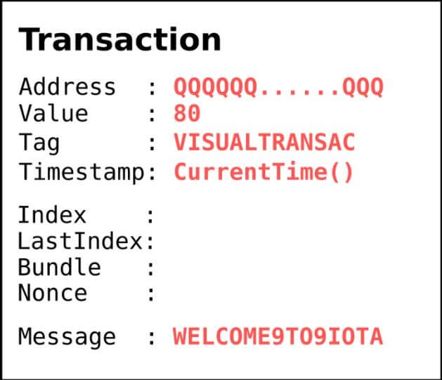
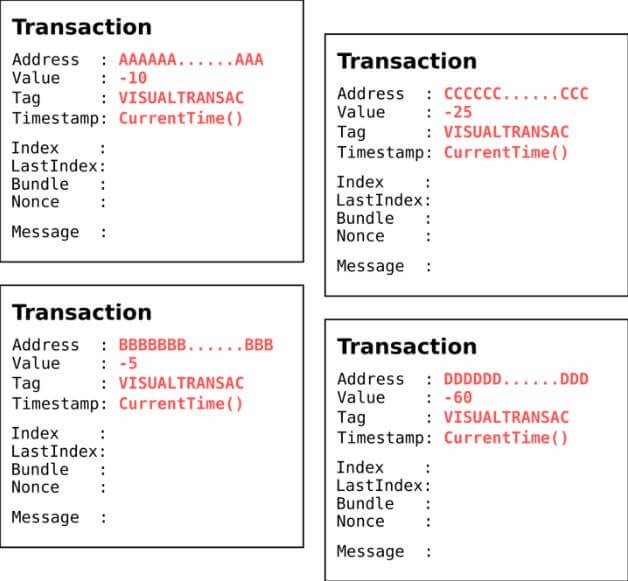
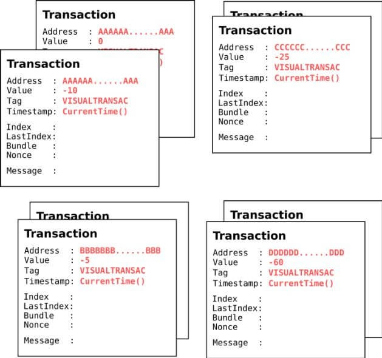
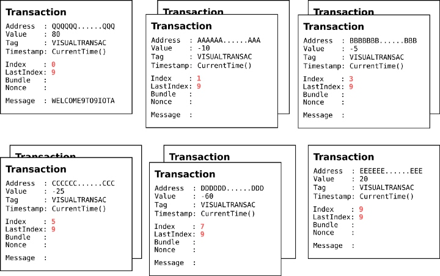
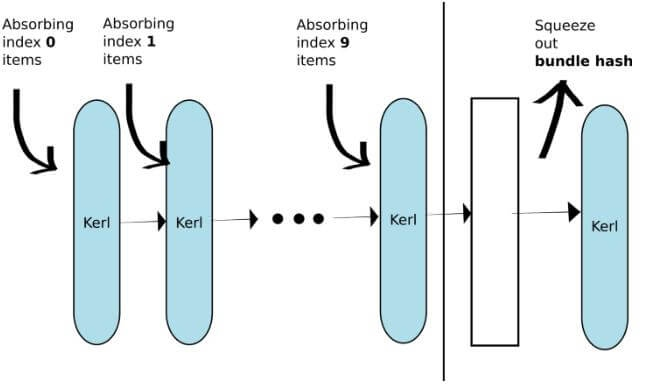
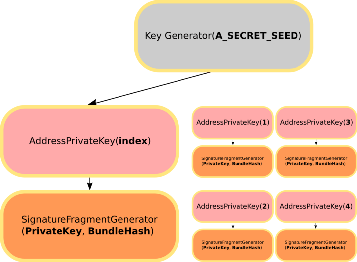
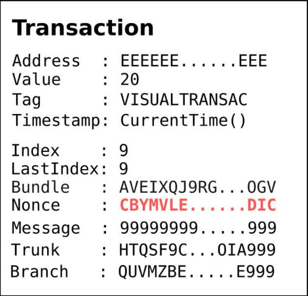
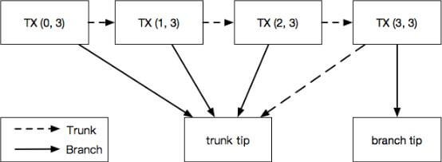

# 深入讲解 IOTA 如何发起一笔交易
在之前的文章中我们已经了解了 IOTA 如何进行交易。 但我决定制作一个图文版本，以确保大家能够更详细的了解其工作原理。
在开始之前请务必先行阅读以下两篇文章：
[Bundles – IOTA Documentations](http://www.iotachina.com/go?url=https://iota.readme.io/v1.2.0/docs/bundles)
[Making a Transaction – IOTA Documentations](http://www.iotachina.com/go?url=https://iota.readme.io/v1.2.0/docs/making-a-transaction)

上列链接可以让你了解有关 IOTA 交易的基本知识。

我们（假设）的交易场景
同学 A 有一个 Seed：A_SECRET_SEED，有 100i 包含在与这个 Seed 有关的 4 个不同的地址中：
```text
Seed ：A_SECRET_SEED
地址[0] ：AAAAAA …… AAA， 余额 ：10
地址[1] ：BBBBBB …… BBB， 余额 ：5
地址[2] ：CCCCCC …… CCC， 余额 ：25
地址[3] ：DDDDD …… DDD， 余额 ：60
地址[4] ：EEEEEE …… EEE， 余额 ：0
```

同学 B 有一个 Seed：B_SECRET_SEED ，其地址中包含 0i：
```text
Seed ：B_SECRET_SEED
地址[0] ：QQQQQQ …… QQQ， 余额 ：0
地址[1] ：QQQQQQ …… VVV， 余额 ：0
```

现在，同学 A 要发送 80i 到同学 B 的地址：[0] QQQQQQ …… QQQ 。

IOTA 如何构建上述交易呢？
## 一、制作 transaction bundle
Bundle 是交易的单位，有三种不同型态的交易，分别是输入（Input），输出（Output），以及元/普通交易（meta transactions）。

- 输入：交易额为负数（提供交易额的交易）
- 输出：交易额为正数（接收交易额的交易）
- 元/普通：交易额为 0，可作为承载签名的交易，或作为存放其他信息的交易。

对于我们的场景，首先我们需要准备 输出 交易，这意味着我们要把 80i IOTA 发送到同学 B 的地址：




输出 80i IOTA 的交易到 B 的地址

接下来，我们需要准备输入交易。在我们的场景中，我们需要使用包含 IOTA (10 + 5 + 25 + 60 > 80) 的全部四个地址来实现输出值 80i。




四个输入交易将 value 花费到 B 的地址

但是我们的输入交易需要包含交易签名，默认的地址安全级别为 2，这意味着我们需要一个额外的元交易来承载交易签名，我们来添加它：




添加所有带有 0 value 元交易的输入交易来承载安全级别为 2 的签名

我们还没有完成，现在我们有一个未结算的的 bundle。稍微计算一下，我们有 10 + 5 + 25 + 60 = 100 IOTA输入和 80 IOTA 输出，这意味着这个 bundle 仍然有 100 – 80 = 20 IOTA 未花费（unspend）。我们就需要一个额外的交易来接收这个未花费的 IOTA。

在正常的连续情况下，IOTA 将从同学 A 的 Seed 中获得一个新的地址，并使用未花费的 value 进行交易：


未花费交易

很好，现在我们得到了结算的 bundle。如您所见，在以前的交易中，我们没有填充 bundle hash 和其他信息。下一步，我们将完成 bundle 以获取 bundle hash。

## 二、完成 Bundle
在这一步中，我们将填充 transaction index、last index，并通过 Kerl hash 函数生成 bundle hash。




填充 index 和 last index

交易验证项（Transaction validate items）包括：Address、value、obsolete tag、timestamp、index 和 last index。Kerl hash 函数使用海绵体构造函数（sponge constructor），所以它会逐个吸收交易验证项（顺序很重要），然后挤压出结果。




使用 Kerl hash 函数和交易验证项来生成 bundle hash

我知道你会对这个计算有意见，为了更精确的计算hash函数的吸收和挤压，请访问维基关于 SHA-3 的内容。

此外，在获取 bundle hash 的步骤中，它会检查 bundle hash 是否安全。如果不是，它将增加 tail 交易（index 0 交易）的 obsolete tag 并重新生成 hash。

在我们得到 bundle hash 之后，我们需要填写 bundle 中的所有交易，因此我们得到：


填充 bundle hash 到所有交易

## 三、签署输入交易的签名
接下来，我们需要使用对应的地址“私钥”签署输入交易。我们可以使用 A_SECRET_SEED 从密钥生成器（key generator）获取地址私钥（address private key）。从地址私钥，我们可以使用带有私钥和 bundle hash 的签名片段生成器（Signature Fragment Generator）来获取交易签名。




使用密钥生成器获得签名片段生成器

[图文]深入讲解 IOTA 如何发起一笔交易


用相应的签名片段生成器填写签名到每个输入交易

至此，我们就完成了制作 Bundle 的所有步骤。

## 四、 获得两个 tips ：trunk 和 branch
本文不会详细介绍 MCMC 算法，认为这是一个黑盒，我们可以通过 getTransactionsToApprove 从 IRI 获得两个 tips。

## 五、工作量证明
在最后一步中，我们需要填充 trunk、branch，并在 bundle 中的每个交易中找到 nonce (工作量证明在此！)

正如 bundle 文档中提到的，bundle 是在 tangle 中的一个原子转移项（atomic transfer item），这意味着在一个 bundle 中，它们会有相同的 tips。

然后，它会遍历 bundle 中的所有交易，从 last index 到 0 index，以填充 trunk、branch hash、timestamp，然后执行 PoW（pearlDiver，IOTA 的 nonce 搜寻算法） 以查找 nonce 并生成交易 hash，然后验证 PoW 结果。


为所有交易填写 trunk，branch，timestamp（是的，再一次）


Pearl Diver 会去查找合适的 nonce, 直到该交易 hash 的尾数 0-trits 数量符合难度规则




最后填充 nonce，我们可以得到交易hash

Last index 的 transaction trunk 和 branch hash 将是我们前面得到的 tips。其他交易的 trunk 将是前面交易的 hash，而 branch hash 是来自 trunk 交易的 tips。




bundle 中的 trunk 与 branch 状况图

如果一切顺利的话，我们就可以得到所有字段都已填充的完整交易 trytes（交易字串）。

> 原文还附了Python 写成的 PoC 程序代码， 已略去。感兴趣可以去原文查阅。 

参考文献：
- 深入讲解 IOTA 如何发起一笔交易 http://www.iotachina.com/iotafaqiyibijiaoyi.html
- IOTA是如何完成一个钱包对钱包免费交易的 http://www.iotachina.com/iotamianfeijiaoyi.html
