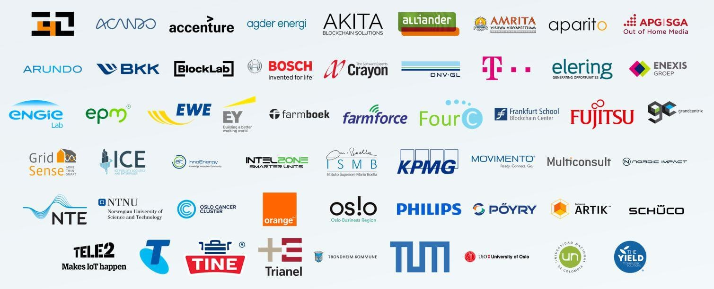

# 合作伙伴
- IOTA 首个正式宣布的合作伙伴关系之一就是数字身份基金会 （DIF）。 DIF 成立的目的是“为人员、组织、应用和设备建立一个开源的去中心化身份生态系统”。DIF 成员包括：Microsoft， RSA, Hyperledger， IBM， R3 ,RSA, ONTology等
- Chain of Things（http://www.chainofthings.com/）宣布建立伙伴关系。Chain of Things是一家致力于物联网（IoT）硬件制造和应用区块链技术于IoT中的科技公司。合作时间2016年。 
- Innogy是德国第二大能源公司–RWE的分公司。我们正携手 Innogy探讨更多机械经济应用案例，特别关注移动性和智能城市。 合作时间2017年3月。
- Ubuntu隶属于Canonical公司，是世界上最受欢迎的操作系统之一，正在与IOTA合作开发更多聚焦于电信的应用。 除此之外，我们将成为LimeSDR的一部分，这是降低移动基站成本的新硬件解决方案。我们有一个与Ubuntu一起设计的完整博客系列。合作时间2017年3月。
- 区块链微支付公司SatoshiPay, 致力于小额数字交易的处理。这家公司宣布和IOTA基金会合作探索用IOTA来取代比特币作为他们的结算网络。合作时间2017年7月。
- 与非营利组织合作Refunite。这种合作伙伴关系尚属首次，标志着分布式账本技术为社会公益服务迈出了重要一步。Refunite拥有世界上最大的失踪人口数据库，覆盖25个以上的国家，着力于为难民寻找亲人的提供帮助。合作时间2017年8月。
- Paragon和IOTA今天宣布合作，旨在创建一个透明的，可验证的数据库，帮助大麻行业迈向更大的合法性。通过结合IOTA独特的方法进行加密和分布式技术，Paragon希望以更低的费用提供更快的技术。Paragon将建立一个完全可验证的数据库，以追踪处方，以及批次的大麻数据（如原产地或THC等级）。合作时间2017年8月。
- Evernym， 2013年成立，开发加密和分布式账本的解决方案, 在相互交易的个人、组织和连接的设备之间建立信任体系。合作时间2017年9月。
- 基于IOTA的Satoshipay演示网页发布上线。合作时间2017年10月。 
- 由Bosch（博世）和1871（芝加哥创业中心）创建的物联网创新组织Chicago Connectory宣布了与IOTA基金会的建立合作伙伴关系。合作时间2017年10月。 
- Sirin实验室即将推出名为“Finney”的世界首款区块链手机，这款手机目标定位于加密社区。SIRIN实验室想要成为安全的开源消费电子领域的世界领先者，弥合了大众市场与区块链经济间的差距。所有Finney设备（还有PC）将构成一个由IOTA的Tangle技术提供支持的独立的区块链。网络将在没有集中式主干的情况下运行，也没有搅局的采矿中心，网络使用SRN令牌作为其默认货币（只有SRN令牌持有人能够购买设备）。它将全部运行在专门用于支持如加密钱包和安全交换访问的区块链应用程序Sirin操作系统上。合作时间2017年10月。 
- Sopra Steria是欧洲数字化转换领域的龙头公司，IOTA是德国的非盈利基金会。它们现在联合起来，发挥自身的优势致力于打造设计框架以优化物联的安全性。合作时间2017年11月。 
- 思科系统公司（纳斯达克代码：CSCO）与IOTA合作创建数据市场。 合作时间2017年12月。
- Augmate正在使用IOTA构建第一个分布式账本技术的物联网设备管理平台。在其核心是一个非区块链的平台，Augmate Connect将从整合IOTA Tangle（无区块的分布式账本）开始，允许在设备之间传输价值而不收取手续费。IOTA是物联网交易结算和数据传输层面的游戏规则改变者。它是基于一种新的分布式账本技术，即Tangle，它克服了当前区块链设计的低效率现状，并在分布式的点对点系统中建立新的共识方式。 合作时间2017年12月。
- IOTA基金会正在与国际交通运输创新中心（ITIC）合作建立智能移动测试平台的全球联盟。ITIC的主要任务是建立一个开放和封闭的测试平台的全球网络，以使用虚拟，增强和物理测试方法在“智能城市”场景中孵化和验证基于AI的可持续性移动服务，并生成一个测试数据池以供整个智能移动生态系统所利用。 因此，开发人员可以访问全球测试平台网络中的测试车队和测试基础设施，IOTA数据市场计划能够提供一个统一的平台，从认证的测试网站获取，共享和选择高质量的测试数据。公共和私人运营的测试平台都能够参加ITIC移动性测试平台联盟，这是受到IOTA基金会支持的ITIC的一项专项计划，旨在为分布式开发人员的全球市场需求建立测试能力。合作时间2018年1月。
-  加拿大 Kontrol 能源公司（Kontrol Energy Corp.）启动 bIOTAsphere 项目，这是一个分布式帐本技术（DLT）加速器和商业化设施，服务于学术界、政府以及希望在分布式能源、碳减排、智能建筑和物联网等领域为市场提供解决方案的商业集团。合作时间2018年2月。

截至2018年3月， 数据市场的合作伙伴达55个
1.  3for2
2.  Acando
3. Accenture
4.  Agder Energi
5. Akita Blockchain Sollutions
6.  Alliander
7. Amrita Vishwa Vidyapeetham
8. Aparito
9.  APG SGA
10.  Arundo
11. BKK
12.  BlockLab
13. **Bosch**
14.  Crayon
15.  DNV GL
16. **T-Mobile**
17. Elering
18. Enexis
19.  Engie Lab
20.  EPM
21.  EWE
22. EY
23.  FarmBoek
24.  FarmForce
25.  FourC
26. Frankfurt School
27. ** Fujitsu**
28. grandcentrix
29. GrindSense
30.  ICE
31.  InnoEnergy
32. IntelZONE
33. ISMB
34. **KPMG**
35. Movimento
36. Multiconsult
37.  Nordic Impact
38.  NTE
39.  NTNU
40. TOslo Cancer Cluster
41. ** Orange**
42. **Os!o**
43. **Philips**
44.  Pöyry
45. **Samsung ARTIK**
46. Schüco
47. Tele2
48. Telstra
49. Tine
50. Trianel
51. Trondheim Kommune
52. Technical Unversity of Munich
53. University of Oslo
54. Universidad Nacional Colombia
55. Yield AgTech Solutions

参考文献：
- http://www.iotachina.com/iotadecentralizeddigitalidentity.html

